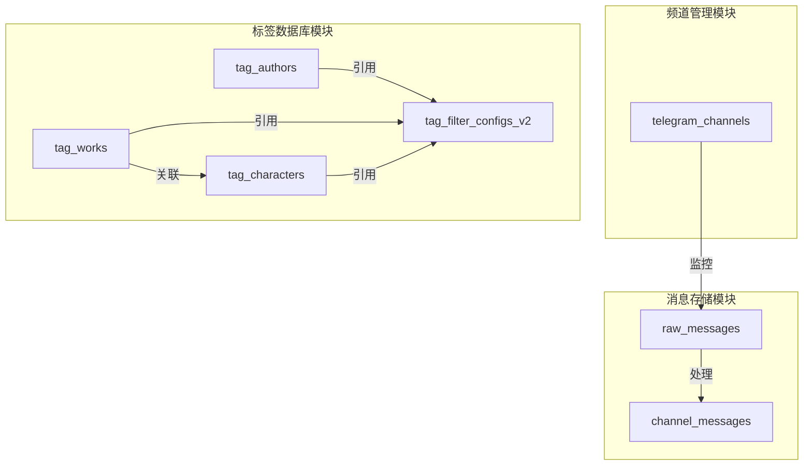

# 数据库结构文档

## 概述

本文档详细描述了 CocoMonya 系统的数据库结构，包括 MongoDB 集合设计、索引策略、数据关系和约束规则。

系统使用 MongoDB 7.0 作为主要数据存储，支持嵌入式和远程两种运行模式。

## 目录

- [1. 数据库配置](#1-数据库配置)
- [2. 集合概览](#2-集合概览)
- [3. 频道管理集合](#3-频道管理集合)
- [4. 消息存储集合](#4-消息存储集合)
- [5. 标签数据库系统](#5-标签数据库系统)
- [6. 索引策略](#6-索引策略)
- [7. 数据关系图](#7-数据关系图)
- [8. 数据约束与验证](#8-数据约束与验证)
- [9. 数据迁移与版本管理](#9-数据迁移与版本管理)

---

## 1. 数据库配置

### 1.1 运行模式

系统支持两种 MongoDB 运行模式：

#### 嵌入式模式（Embedded）

- **适用场景**：开发环境、单机部署
- **配置位置**：`application.yaml`
- **数据目录**：`data/db/mongo/`
- **默认端口**：27017
- **绑定地址**：127.0.0.1

```yaml
spring:
  data:
    mongodb:
      mode: embedded
      embedded:
        version: 7.0.12
        port: 27017
        bind-ip: 127.0.0.1
```

#### 远程模式（Remote）

- **适用场景**：生产环境、集群部署
- **配置位置**：`application.yaml`
- **连接方式**：MongoDB URI

```yaml
spring:
  data:
    mongodb:
      mode: remote
      uri: mongodb://localhost:27017/cocomonya
```

### 1.2 数据库名称

- **数据库名称**：`cocomonya`
- **字符集**：UTF-8
- **时区**：系统默认时区

### 1.3 数据目录结构

```
data/
├── db/
│   └── mongo/                    # MongoDB 数据文件
│       ├── collection-*.wt       # 集合数据文件
│       ├── index-*.wt            # 索引文件
│       ├── journal/              # 日志文件
│       ├── diagnostic.data/      # 诊断数据
│       └── WiredTiger*           # WiredTiger 存储引擎文件
├── config/
│   └── .env                      # 环境配置文件
└── logs/                         # 应用日志
```

---

## 2. 集合概览

系统包含 7 个主要集合，分为三大功能模块：

### 2.1 集合列表

| 集合名称 | 用途 | 文档数量级 | 主要索引 |
|---------|------|-----------|---------|
| `telegram_channels` | 频道监控配置 | 数十 | channelId(unique) |
| `raw_messages` | 原始消息存储 | 数万-数十万 | chatId+messageId(unique) |
| `channel_messages` | 处理后的消息 | 数万-数十万 | chatId+messageId(unique) |
| `tag_authors` | 作者标签库 | 数百-数千 | name(unique) |
| `tag_works` | 原作标签库 | 数百-数千 | name(unique) |
| `tag_characters` | 角色标签库 | 数千-数万 | name(unique) |
| `tag_filter_configs_v2` | 标签过滤配置 | 1 | id |

### 2.2 功能模块划分



---

## 3. 频道管理集合

### 3.1 telegram_channels

存储 Telegram 频道的监控配置信息。

#### 3.1.1 集合结构

```javascript
{
  "_id": ObjectId("65f8a1b2c3d4e5f6a7b8c9d0"),
  "channelId": NumberLong(-1001234567890),
  "channelUsername": "example_channel",
  "channelTitle": "示例频道",
  "monitoringStatus": true,
  "createTime": ISODate("2024-03-20T10:30:00Z"),
  "updateTime": ISODate("2024-03-20T10:30:00Z")
}
```

#### 3.1.2 字段说明

| 字段名 | 类型 | 必填 | 说明 | 约束 |
|-------|------|------|------|------|
| _id | ObjectId | 是 | MongoDB 文档 ID | 自动生成 |
| channelId | Long | 是 | Telegram 频道 ID | 唯一索引 |
| channelUsername | String | 否 | 频道用户名（不含@） | 长度≤100 |
| channelTitle | String | 是 | 频道标题 | 长度1-200 |
| monitoringStatus | Boolean | 是 | 监控状态 | true/false |
| createTime | DateTime | 是 | 创建时间 | ISO 8601 |
| updateTime | DateTime | 是 | 更新时间 | ISO 8601 |

#### 3.1.3 索引设计

```javascript
// 唯一索引：channelId
db.telegram_channels.createIndex(
  { "channelId": 1 }, 
  { unique: true, name: "idx_channelId_unique" }
)

// 普通索引：monitoringStatus
db.telegram_channels.createIndex(
  { "monitoringStatus": 1 }, 
  { name: "idx_monitoringStatus" }
)
```

#### 3.1.4 业务规则

1. **唯一性约束**：channelId 在系统中必须唯一
2. **默认值**：monitoringStatus 默认为 true
3. **时间戳**：createTime 和 updateTime 自动维护
4. **删除策略**：删除频道不会删除相关消息（软删除）

---

## 4. 消息存储集合

### 4.1 raw_messages

存储从 TDLib 接收的原始消息 JSON 数据。

#### 4.1.1 集合结构

```javascript
{
  "_id": ObjectId("65f8a1b2c3d4e5f6a7b8c9d0"),
  "chatId": NumberLong(-1001234567890),
  "messageId": NumberLong(123456),
  "mediaAlbumId": NumberLong(7890123456789),
  "date": NumberInt(1710921600),
  "rawJson": "{\"@type\":\"message\",\"id\":123456,...}",
  "createTime": ISODate("2024-03-20T10:30:00Z"),
  "updateTime": ISODate("2024-03-20T10:30:00Z")
}
```

#### 4.1.2 字段说明

| 字段名 | 类型 | 必填 | 说明 | 约束 |
|-------|------|------|------|------|
| _id | ObjectId | 是 | MongoDB 文档 ID | 自动生成 |
| chatId | Long | 是 | 频道 ID | 索引 |
| messageId | Long | 是 | 消息 ID | 索引 |
| mediaAlbumId | Long | 否 | 媒体组 ID | 索引，可为null |
| date | Integer | 是 | 消息日期（Unix时间戳） | - |
| rawJson | String | 是 | TDLib 消息 JSON | - |
| createTime | DateTime | 是 | 创建时间 | ISO 8601 |
| updateTime | DateTime | 是 | 更新时间 | ISO 8601 |

#### 4.1.3 索引设计

```javascript
// 复合唯一索引：chatId + messageId
db.raw_messages.createIndex(
  { "chatId": 1, "messageId": 1 }, 
  { unique: true, name: "chat_message_unique" }
)

// 复合唯一索引：chatId + mediaAlbumId（稀疏索引）
db.raw_messages.createIndex(
  { "chatId": 1, "mediaAlbumId": 1 }, 
  { unique: true, sparse: true, name: "chat_album_unique" }
)

// 复合索引：chatId + date（降序）
db.raw_messages.createIndex(
  { "chatId": 1, "date": -1 }, 
  { name: "chat_date_idx" }
)

// 单字段索引
db.raw_messages.createIndex({ "chatId": 1 })
db.raw_messages.createIndex({ "messageId": 1 })
db.raw_messages.createIndex({ "mediaAlbumId": 1 })
```

#### 4.1.4 业务规则

1. **唯一性约束**：同一频道的同一消息只能存储一次
2. **媒体组处理**：mediaAlbumId 相同的消息属于同一媒体组
3. **稀疏索引**：mediaAlbumId 索引为稀疏索引，仅索引非null值
4. **数据保留**：原始消息永久保留，用于数据恢复和审计

### 4.2 channel_messages

存储经过处理和结构化的频道消息。

#### 4.2.1 集合结构

```javascript
{
  "_id": ObjectId("65f8a1b2c3d4e5f6a7b8c9d0"),
  "messageId": NumberLong(123456),
  "chatId": NumberLong(-1001234567890),
  "channelUsername": "example_channel",
  "channelTitle": "示例频道",
  "date": NumberInt(1710921600),
  "editDate": NumberInt(1710925200),
  "contentType": "text",
  "textContent": "消息文本内容",
  "mediaFiles": [
    {
      "fileId": "file_123",
      "fileType": "photo",
      "fileSize": NumberLong(1024000),
      "mimeType": "image/jpeg",
      "localPath": "/path/to/file",
      "downloaded": true
    }
  ],
  "webPage": {
    "url": "https://example.com/article",
    "displayUrl": "example.com/article",
    "type": "article",
    "siteName": "Example Site",
    "title": "文章标题",
    "description": "文章描述",
    "author": "作者名",
    "duration": null,
    "hasInstantView": true,
    "instantViewVersion": "2.0"
  },
  "mediaAlbumId": NumberLong(7890123456789),
  "isMediaGroup": true,
  "mediaGroupItemCount": NumberInt(3),
  "mediaGroupMessageIds": [NumberLong(123456), NumberLong(123457), NumberLong(123458)],
  "views": NumberInt(1000),
  "forwards": NumberInt(50),
  "status": "PENDING",
  "createTime": ISODate("2024-03-20T10:30:00Z"),
  "updateTime": ISODate("2024-03-20T10:30:00Z")
}
```

#### 4.2.2 字段说明

| 字段名 | 类型 | 必填 | 说明 | 约束 |
|-------|------|------|------|------|
| _id | ObjectId | 是 | MongoDB 文档 ID | 自动生成 |
| messageId | Long | 是 | 消息 ID | 索引 |
| chatId | Long | 是 | 频道 ID | 索引 |
| channelUsername | String | 否 | 频道用户名 | - |
| channelTitle | String | 否 | 频道标题 | - |
| date | Integer | 是 | 消息日期（Unix时间戳） | - |
| editDate | Integer | 否 | 编辑日期（Unix时间戳） | - |
| contentType | String | 是 | 内容类型 | text/photo/video等 |
| textContent | String | 否 | 文本内容 | - |
| mediaFiles | Array | 否 | 媒体文件列表 | - |
| webPage | Object | 否 | 网页信息 | - |
| mediaAlbumId | Long | 否 | 媒体组 ID | 索引 |
| isMediaGroup | Boolean | 否 | 是否为媒体组 | - |
| mediaGroupItemCount | Integer | 否 | 媒体组项目数 | - |
| mediaGroupMessageIds | Array | 否 | 媒体组消息ID列表 | - |
| views | Integer | 否 | 浏览次数 | - |
| forwards | Integer | 否 | 转发次数 | - |
| status | String | 是 | 消息状态 | PENDING/APPROVED/REJECTED |
| createTime | DateTime | 是 | 创建时间 | ISO 8601 |
| updateTime | DateTime | 是 | 更新时间 | ISO 8601 |

#### 4.2.3 嵌套对象结构

**MediaFile（媒体文件）**

| 字段名 | 类型 | 说明 |
|-------|------|------|
| fileId | String | 文件 ID |
| fileType | String | 文件类型（photo/video/document等） |
| fileSize | Long | 文件大小（字节） |
| mimeType | String | MIME 类型 |
| localPath | String | 本地存储路径 |
| downloaded | Boolean | 是否已下载 |

**WebPageInfo（网页信息）**

| 字段名 | 类型 | 说明 |
|-------|------|------|
| url | String | 网页 URL |
| displayUrl | String | 显示 URL |
| type | String | 类型（article/photo/video等） |
| siteName | String | 网站名称 |
| title | String | 标题 |
| description | String | 描述 |
| author | String | 作者 |
| duration | Integer | 视频/音频时长（秒） |
| hasInstantView | Boolean | 是否有即时预览（Telegraph） |
| instantViewVersion | String | 即时预览版本 |

#### 4.2.4 索引设计

```javascript
// 复合唯一索引：chatId + messageId
db.channel_messages.createIndex(
  { "chatId": 1, "messageId": 1 }, 
  { unique: true, name: "chat_message_unique" }
)

// 复合索引：chatId + date（降序）
db.channel_messages.createIndex(
  { "chatId": 1, "date": -1 }, 
  { name: "chat_date_idx" }
)

// 复合索引：status + createTime（降序）
db.channel_messages.createIndex(
  { "status": 1, "createTime": -1 }, 
  { name: "status_date_idx" }
)

// 复合索引：chatId + mediaAlbumId + date
db.channel_messages.createIndex(
  { "chatId": 1, "mediaAlbumId": 1, "date": 1 }, 
  { name: "media_album_idx" }
)

// 单字段索引
db.channel_messages.createIndex({ "messageId": 1 })
db.channel_messages.createIndex({ "chatId": 1 })
db.channel_messages.createIndex({ "mediaAlbumId": 1 })
db.channel_messages.createIndex({ "status": 1 })
```

#### 4.2.5 业务规则

1. **消息状态流转**：PENDING → APPROVED/REJECTED
2. **媒体组处理**：同一 mediaAlbumId 的消息作为一组处理
3. **内容类型**：根据 TDLib 消息类型自动识别
4. **网页预览**：自动提取 Telegraph 和其他网页信息
5. **数据完整性**：与 raw_messages 保持一致性

---

## 5. 标签数据库系统

标签数据库系统包含三个独立的标签库和一个全局配置集合。

### 5.1 全局唯一性约束

所有标签实体（作者、原作、角色）的名称和别名在全局范围内必须唯一：

- 作者名称不能与任何其他作者、原作、角色的名称或别名重复
- 原作名称不能与任何其他作者、原作、角色的名称或别名重复
- 角色名称不能与任何其他作者、原作、角色的名称或别名重复
- 所有别名在全局范围内唯一，不能与任何实体的名称或其他别名重复

### 5.2 tag_authors（作者库）

存储作者信息及其别名。

#### 5.2.1 集合结构

```javascript
{
  "_id": ObjectId("65f8a1b2c3d4e5f6a7b8c9d0"),
  "name": "张三",
  "aliases": ["作者别名1", "作者别名2"],
  "signature": "这是作者的个性签名",
  "urls": ["https://example.com/author1", "https://twitter.com/author1"],
  "avatarBase64": "data:image/png;base64,iVBORw0KGgo...",
  "remark": "这是备注信息",
  "createTime": ISODate("2024-03-20T10:30:00Z"),
  "updateTime": ISODate("2024-03-20T10:30:00Z")
}
```

#### 5.2.2 字段说明

| 字段名 | 类型 | 必填 | 说明 | 约束 |
|-------|------|------|------|------|
| _id | ObjectId | 是 | MongoDB 文档 ID | 自动生成 |
| name | String | 是 | 作者名称 | 全局唯一，长度≤100 |
| aliases | Array | 是 | 别名列表 | 可为空数组，每个别名全局唯一，长度≤100 |
| signature | String | 否 | 个性签名 | 可为null，长度≤500 |
| urls | Array | 否 | 网址列表 | 可为空数组，每个URL长度≤500 |
| avatarBase64 | String | 否 | BASE64编码的头像 | 可为null |
| remark | String | 否 | 备注信息 | 可为null，长度≤1000 |
| createTime | DateTime | 是 | 创建时间 | ISO 8601 |
| updateTime | DateTime | 是 | 更新时间 | ISO 8601 |

#### 5.2.3 索引设计

```javascript
// 唯一索引：name
db.tag_authors.createIndex(
  { "name": 1 }, 
  { unique: true, name: "idx_author_name_unique" }
)

// 多键索引：aliases
db.tag_authors.createIndex(
  { "aliases": 1 }, 
  { name: "idx_author_aliases" }
)
```

### 5.3 tag_works（原作库）

存储原作信息及其别名。

#### 5.3.1 集合结构

```javascript
{
  "_id": ObjectId("65f8a1b2c3d4e5f6a7b8c9d0"),
  "name": "原作名称",
  "aliases": ["原作别名1", "原作别名2"],
  "urls": ["https://example.com/work1", "https://wiki.example.com/work1"],
  "avatarBase64": "data:image/png;base64,iVBORw0KGgo...",
  "remark": "这是原作的备注信息",
  "createTime": ISODate("2024-03-20T10:30:00Z"),
  "updateTime": ISODate("2024-03-20T10:30:00Z")
}
```

#### 5.3.2 字段说明

| 字段名 | 类型 | 必填 | 说明 | 约束 |
|-------|------|------|------|------|
| _id | ObjectId | 是 | MongoDB 文档 ID | 自动生成 |
| name | String | 是 | 原作名称 | 全局唯一，长度≤100 |
| aliases | Array | 是 | 别名列表 | 可为空数组，每个别名全局唯一，长度≤100 |
| urls | Array | 否 | 网址列表 | 可为空数组，每个URL长度≤500 |
| avatarBase64 | String | 否 | BASE64编码的头像 | 可为null |
| remark | String | 否 | 备注信息 | 可为null，长度≤1000 |
| createTime | DateTime | 是 | 创建时间 | ISO 8601 |
| updateTime | DateTime | 是 | 更新时间 | ISO 8601 |

#### 5.3.3 索引设计

```javascript
// 唯一索引：name
db.tag_works.createIndex(
  { "name": 1 }, 
  { unique: true, name: "idx_work_name_unique" }
)

// 多键索引：aliases
db.tag_works.createIndex(
  { "aliases": 1 }, 
  { name: "idx_work_aliases" }
)
```

### 5.4 tag_characters（角色库）

存储角色信息、所属原作及其别名。

#### 5.4.1 集合结构

```javascript
{
  "_id": ObjectId("65f8a1b2c3d4e5f6a7b8c9d0"),
  "name": "角色名称",
  "aliases": ["角色别名1", "角色别名2"],
  "workId": "65f8a1b2c3d4e5f6a7b8c9d1",
  "species": "人类",
  "avatarBase64": "data:image/png;base64,iVBORw0KGgo...",
  "remark": "这是角色的备注信息",
  "createTime": ISODate("2024-03-20T10:30:00Z"),
  "updateTime": ISODate("2024-03-20T10:30:00Z")
}
```

#### 5.4.2 字段说明

| 字段名 | 类型 | 必填 | 说明 | 约束 |
|-------|------|------|------|------|
| _id | ObjectId | 是 | MongoDB 文档 ID | 自动生成 |
| name | String | 是 | 角色名称 | 全局唯一，长度≤100 |
| aliases | Array | 是 | 别名列表 | 可为空数组，每个别名全局唯一，长度≤100 |
| workId | String | 否 | 所属原作ID | 可为null，如果提供则必须在原作库中存在 |
| species | String | 是 | 种族 | 长度≤100 |
| avatarBase64 | String | 否 | BASE64编码的头像 | 可为null |
| remark | String | 否 | 备注信息 | 可为null，长度≤1000 |
| createTime | DateTime | 是 | 创建时间 | ISO 8601 |
| updateTime | DateTime | 是 | 更新时间 | ISO 8601 |

#### 5.4.3 索引设计

```javascript
// 唯一索引：name
db.tag_characters.createIndex(
  { "name": 1 }, 
  { unique: true, name: "idx_character_name_unique" }
)

// 多键索引：aliases
db.tag_characters.createIndex(
  { "aliases": 1 }, 
  { name: "idx_character_aliases" }
)

// 普通索引：workId
db.tag_characters.createIndex(
  { "workId": 1 }, 
  { name: "idx_character_workId" }
)
```
