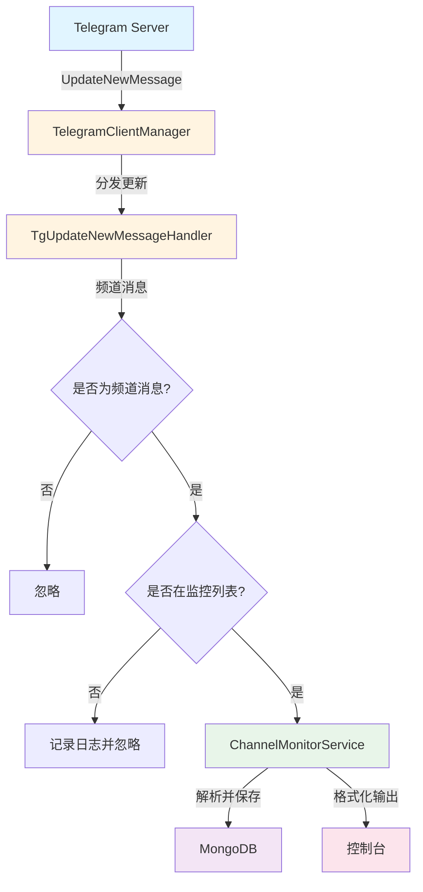
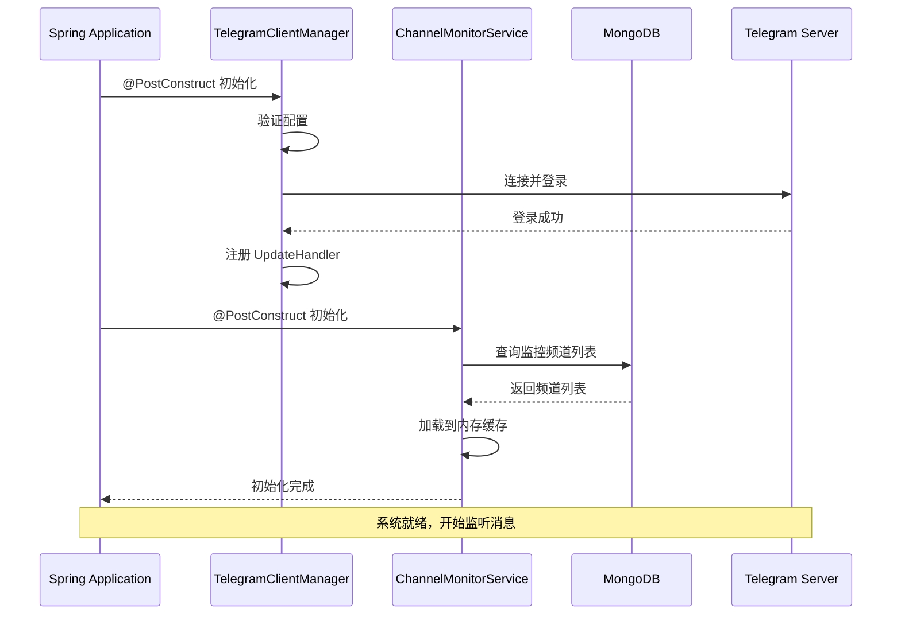
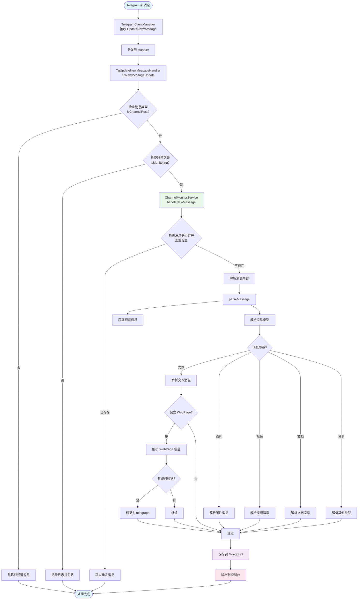
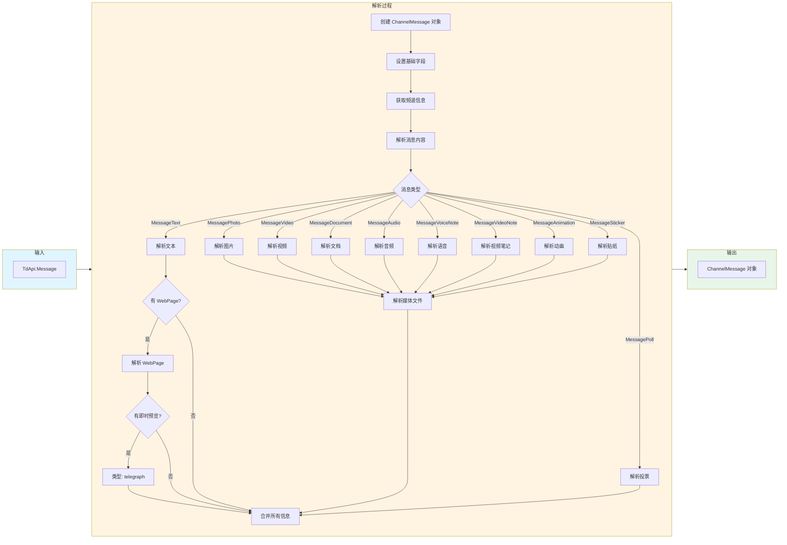
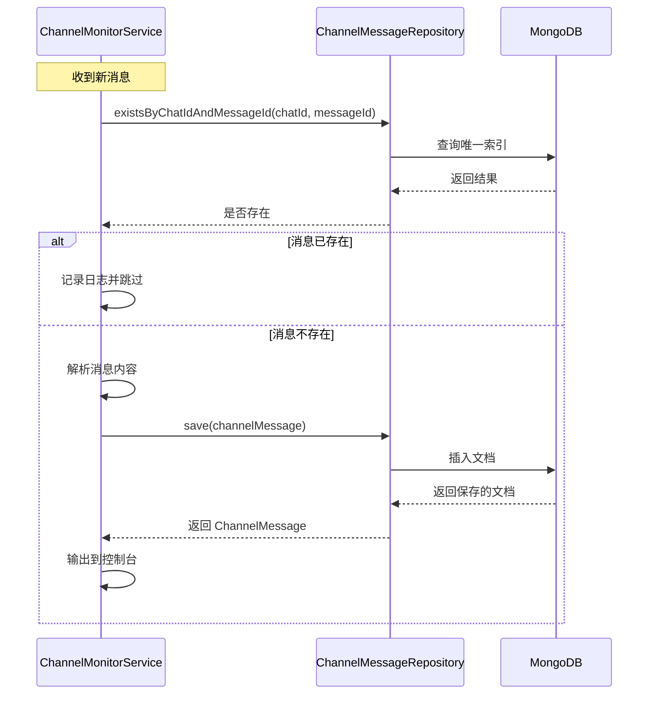
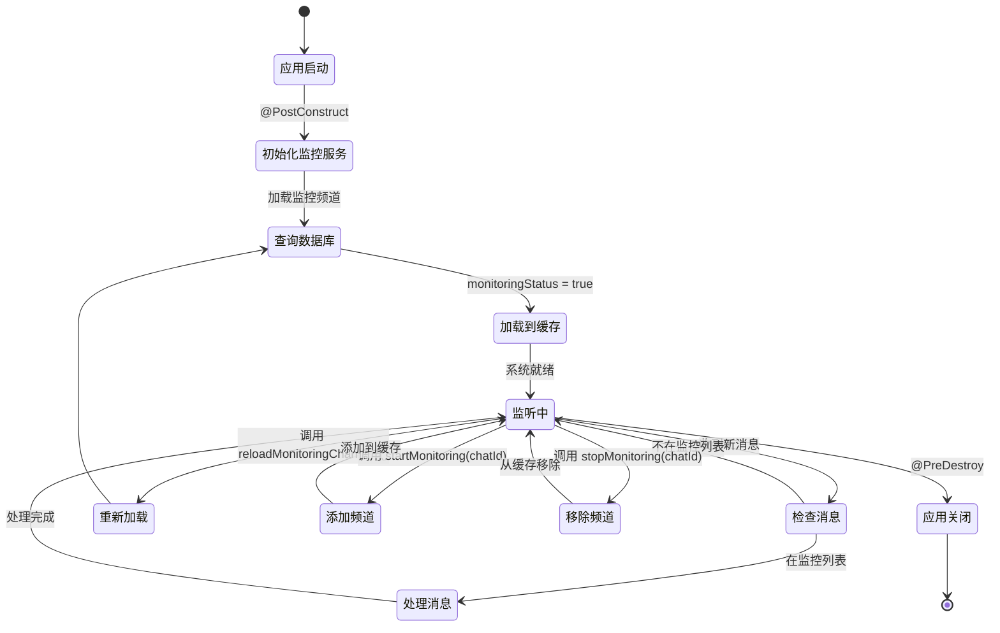
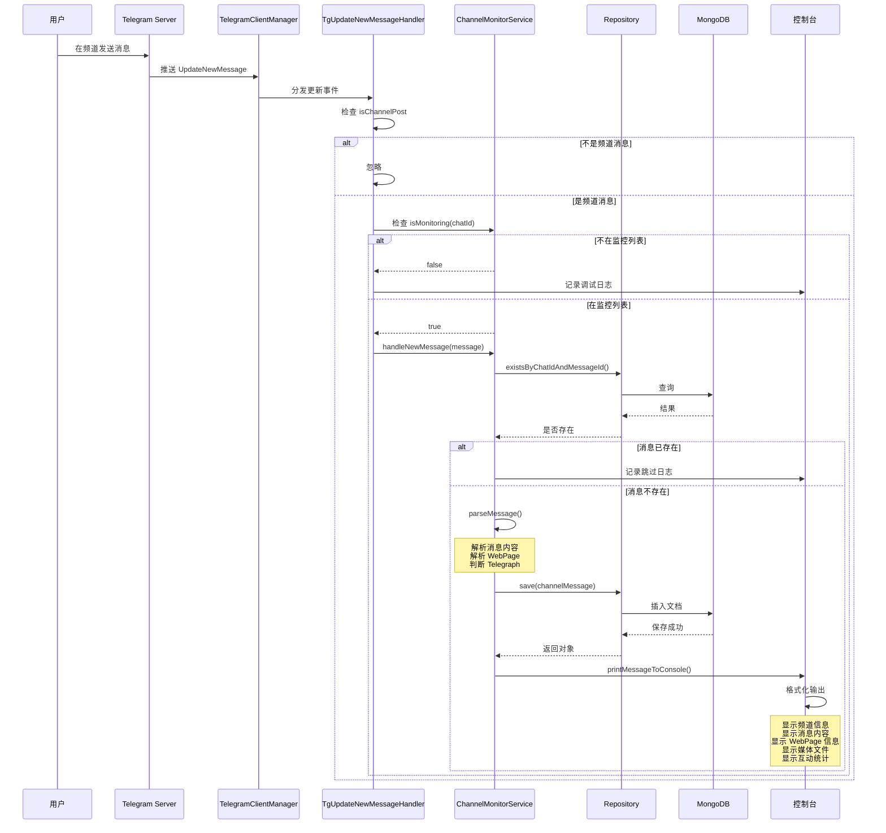
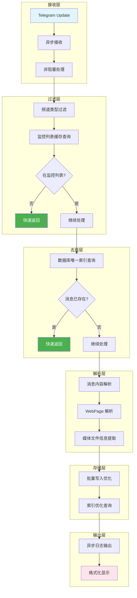
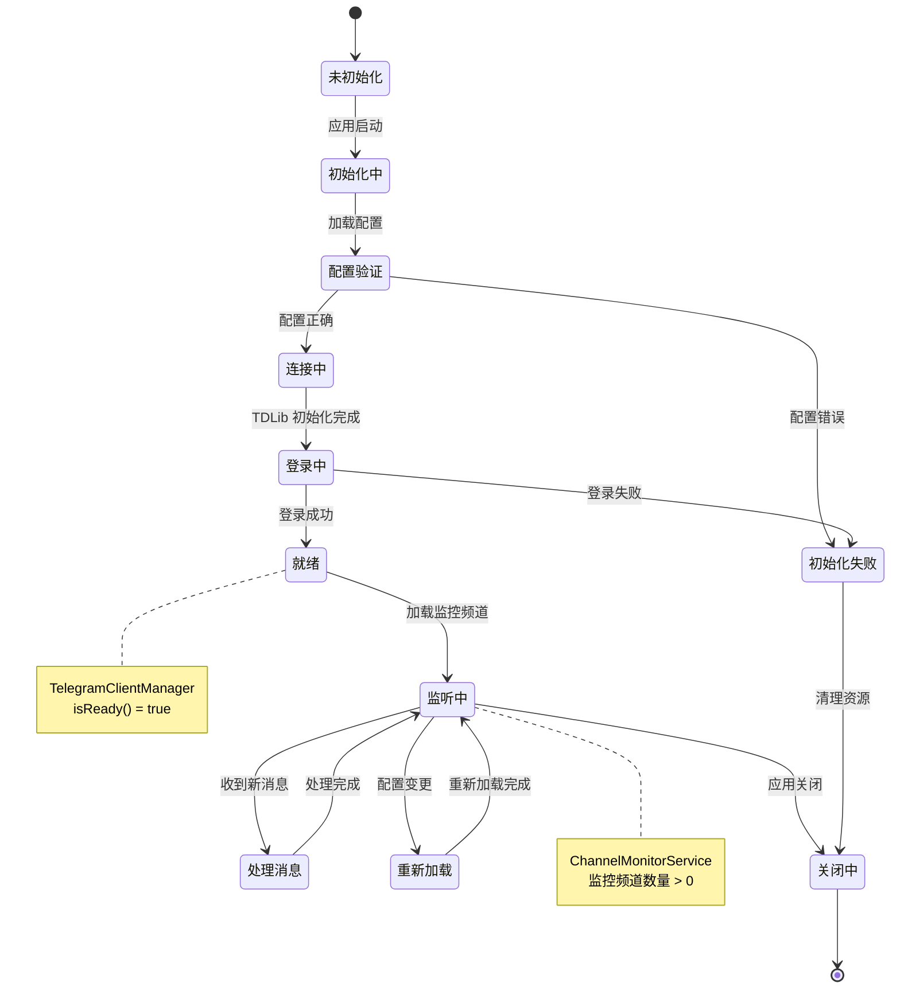

# 消息处理流程图

本文档展示了 Telegram 频道消息监控系统的完整处理流程。

## 1. 系统整体架构

## 2. 应用启动流程

## 3. 消息接收和处理流程

## 4. 消息内容解析详细流程

## 5. Telegraph 文章识别流程

## 6. 数据库交互流程

## 7. 监控频道管理流程

## 8. 错误处理流程

## 9. 完整的端到端流程

## 10. 性能优化流程

## 11. 系统状态机

## 流程图说明

### 图表类型说明

1. **graph TB/LR** - 基础流程图（从上到下/从左到右）
2. **flowchart TD/LR** - 增强流程图，支持更多形状
3. **sequenceDiagram** - 时序图，展示组件间交互
4. **stateDiagram-v2** - 状态机图，展示状态转换

### 节点形状说明

- `[]` - 矩形：普通处理步骤
- `{}` - 菱形：判断/决策点
- `()` - 圆角矩形：开始/结束
- `[()]` - 圆形：状态节点

### 颜色说明

- 蓝色 (#e1f5ff) - 输入/开始
- 黄色 (#fff4e1) - 处理中
- 绿色 (#e8f5e9) - 核心服务
- 紫色 (#f3e5f5) - 数据库
- 粉色 (#fce4ec) - 输出/显示

## 使用建议

1. **查看整体架构**：从图 1 开始，了解系统组件关系
2. **理解启动流程**：查看图 2，了解系统如何初始化
3. **跟踪消息处理**：查看图 3 和图 9，了解完整的消息处理流程
4. **深入特定功能**：根据需要查看 Telegraph、错误处理等专项流程图
5. **性能优化参考**：查看图 10，了解系统的性能优化点

## 相关文档

- [Telegram频道实时监控技术方案](./Telegram频道实时监控技术方案.md)
- [Telegraph支持说明](./Telegraph支持说明.md)
- [功能实现总结](./功能实现总结.md)
- [Telegraph-Testing-Guide](./Telegraph-Testing-Guide.md)
