# 消息处理流程图

本文档展示了 Telegram 频道消息监控系统的完整处理流程，包括媒体组（消息组）的处理。

## 1. 系统整体架构

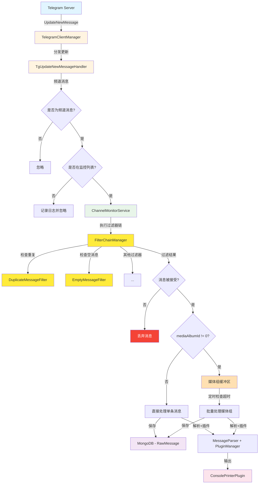

## 2. 应用启动流程

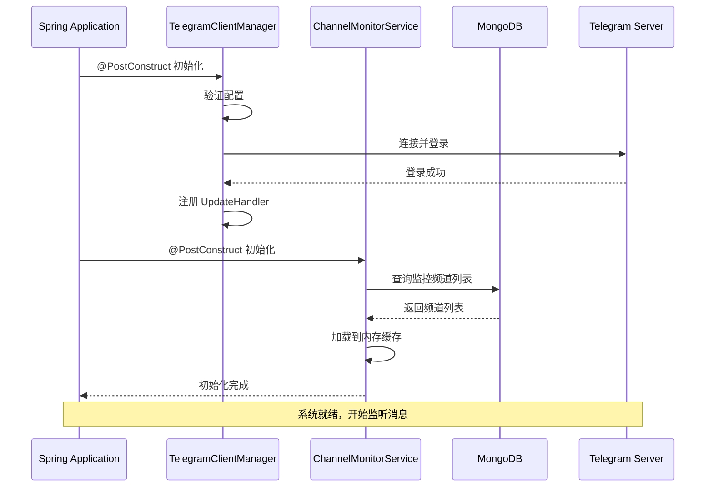

## 3. 消息接收和处理流程（含过滤器链和媒体组）

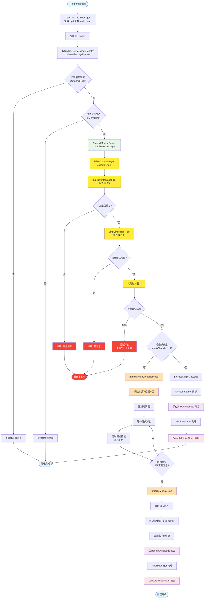

## 4. 过滤器链处理流程

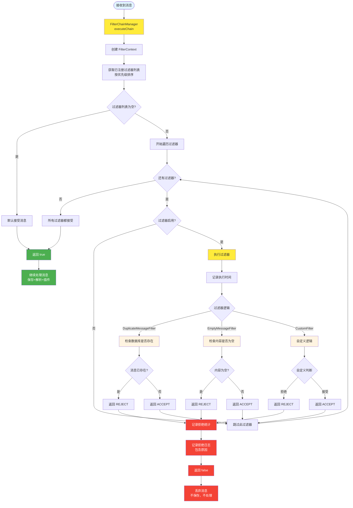

### 过滤器优先级

过滤器按优先级从高到低执行：

1. **EmptyMessageFilter (100)** - 检查空消息
2. **DuplicateMessageFilter (95)** - 检查重复消息
3. **MessageTypeFilter (90)** - 类型过滤（可选）
4. **自定义过滤器 (0-89)** - 用户自定义

### 过滤器特点

- **快速失败**: 任何过滤器返回 REJECT，立即停止链并丢弃消息
- **错误容错**: 过滤器出错时默认接受消息（fail-open）
- **统计记录**: 记录每个过滤器的执行时间和拒绝次数
- **动态管理**: 支持运行时启用/禁用过滤器

## 5. 消息内容解析详细流程

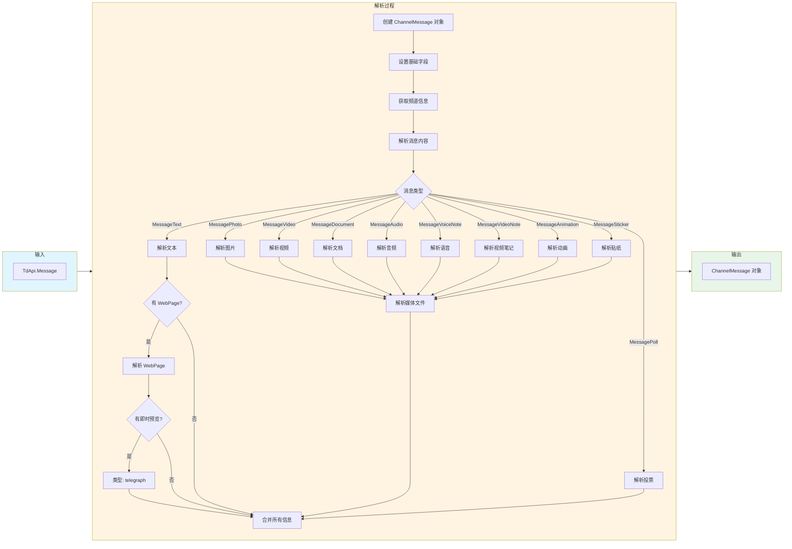

## 5. Telegraph 文章识别流程

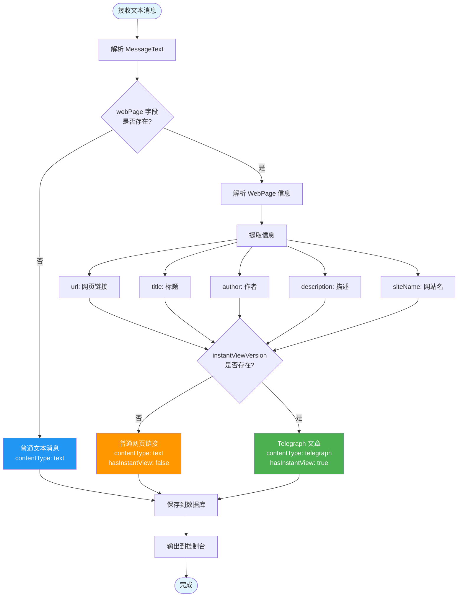

## 6. 媒体组（消息组）处理详细流程


## 7. 数据库交互流程

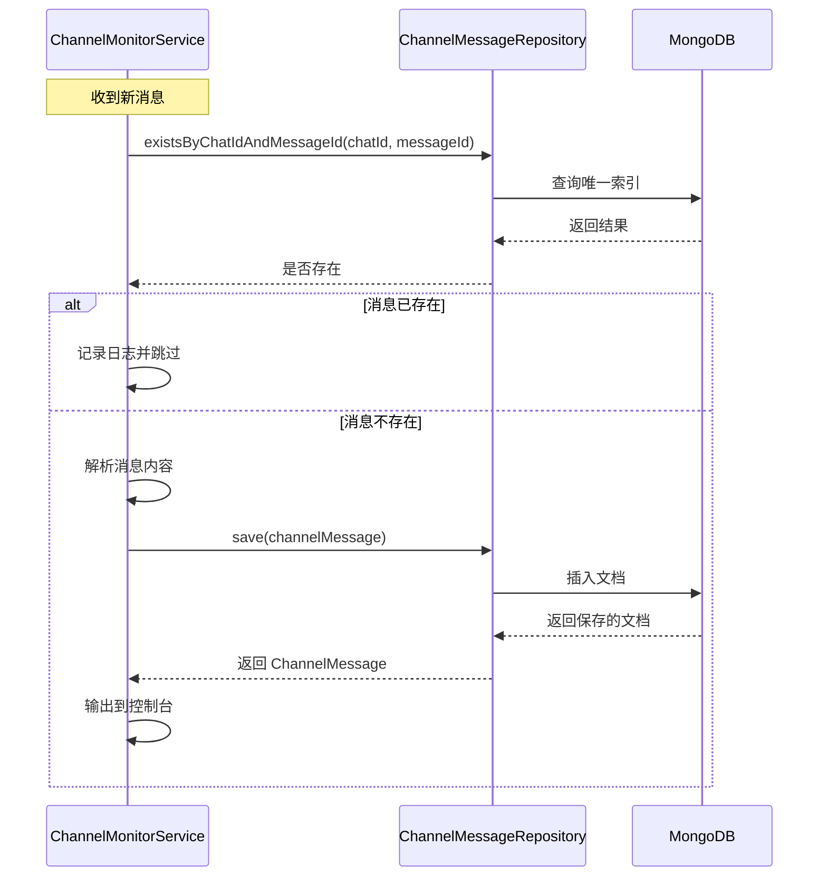

## 7. 数据库交互流程（含媒体组）

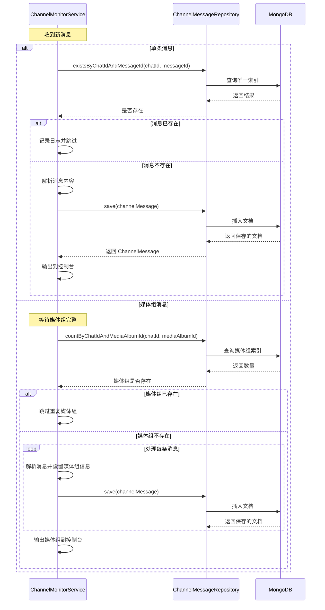

## 8. 监控频道管理流程

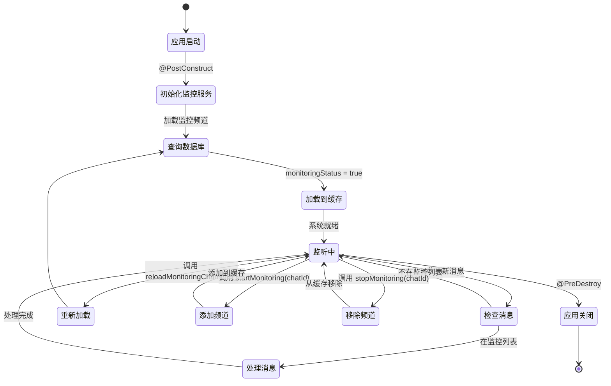

## 8. 监控频道管理流程


## 9. 错误处理流程

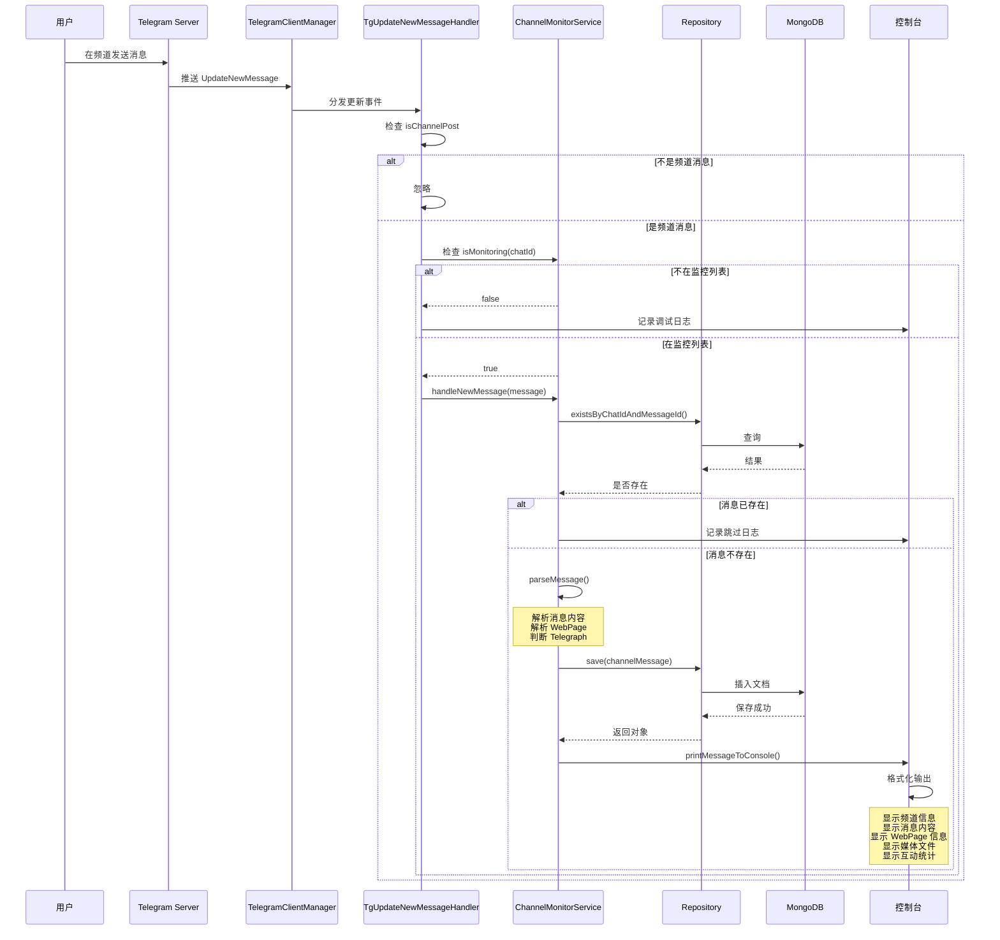

## 11. 完整的端到端流程（含过滤器链和媒体组）

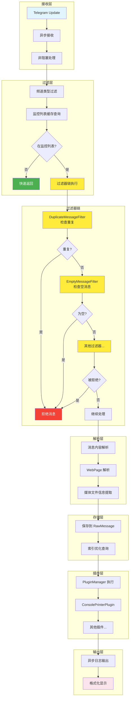

## 11. 性能优化流程

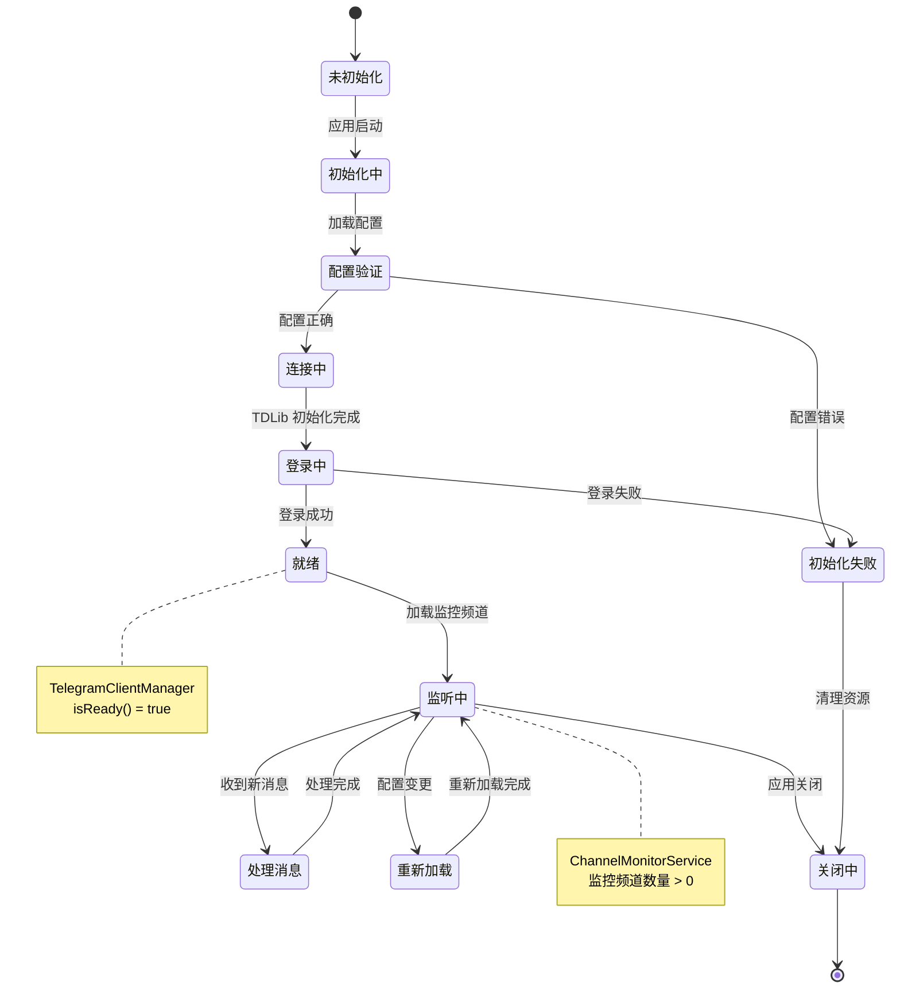

## 12. 系统状态机

### 图表类型说明

1. **graph TB/LR** - 基础流程图（从上到下/从左到右）
2. **flowchart TD/LR** - 增强流程图，支持更多形状
3. **sequenceDiagram** - 时序图，展示组件间交互
4. **stateDiagram-v2** - 状态机图，展示状态转换

### 节点形状说明

- `[]` - 矩形：普通处理步骤
- `{}` - 菱形：判断/决策点
- `()` - 圆角矩形：开始/结束
- `[()]` - 圆形：状态节点

### 颜色说明

- 蓝色 (#e1f5ff) - 输入/开始
- 黄色 (#fff4e1) - 处理中
- 绿色 (#e8f5e9) - 核心服务
- 紫色 (#f3e5f5) - 数据库
- 粉色 (#fce4ec) - 输出/显示

## 使用建议

1. **查看整体架构**：从图 1 开始，了解系统组件关系
2. **理解启动流程**：查看图 2，了解系统如何初始化
3. **跟踪消息处理**：查看图 3 和图 10，了解完整的消息处理流程
4. **理解媒体组处理**：查看图 5 和图 6，了解媒体组的缓冲和批量处理机制
5. **深入特定功能**：根据需要查看 Telegraph、错误处理等专项流程图
6. **性能优化参考**：查看图 11，了解系统的性能优化点

## 媒体组（消息组）处理说明

### 什么是媒体组？

媒体组（Media Album）是 Telegram 中将多个媒体文件（图片、视频、文档、音频）作为一组发送的功能。在 TDLib 中，属于同一媒体组的消息具有相同的非零 `mediaAlbumId`。

### 处理机制

1. **缓冲机制**：
   - 收到带有 `mediaAlbumId` 的消息时，不立即处理
   - 将消息添加到缓冲区，等待同组的其他消息
   - 使用 `chatId:mediaAlbumId` 作为缓冲区的键

2. **超时机制**：
   - 每秒检查一次缓冲区
   - 如果某个媒体组 2 秒内没有新消息，认为该组已完整
   - 触发批量处理

3. **批量处理**：
   - 按消息 ID 排序，确保顺序一致
   - 检查媒体组是否已存在（去重）
   - 为每条消息设置媒体组信息
   - 批量保存到数据库
   - 统一输出到控制台

### 数据结构

```java
// ChannelMessage 实体
private Long mediaAlbumId;              // 媒体组ID，0表示不属于任何组
private Boolean isMediaGroup;           // 是否为媒体组消息
private Integer mediaGroupItemCount;    // 媒体组中的项目数量
private List<Long> mediaGroupMessageIds; // 媒体组中所有消息的ID列表
```

### 控制台输出示例

```
━━━━━━━━━━━━━━━━━━━━━━━━━━━━━━━━━━━━━━━━━━━━━━━━━━━━━━━━━━━━━━━━━━━━━━━━━━━━━━
📨 收到媒体组消息
━━━━━━━━━━━━━━━━━━━━━━━━━━━━━━━━━━━━━━━━━━━━━━━━━━━━━━━━━━━━━━━━━━━━━━━━━━━━━━
频道: 测试频道 (@test_channel)
媒体组ID: 5629499534213120
频道ID: -1001234567890
消息数量: 3 条
时间: 2024-02-22T20:30:45
━━━━━━━━━━━━━━━━━━━━━━━━━━━━━━━━━━━━━━━━━━━━━━━━━━━━━━━━━━━━━━━━━━━━━━━━━━━━━━
📎 媒体组内容:
  [1] 消息ID: 123456, 类型: photo
      说明: 第一张图片
      - 文件类型: photo, 大小: 102400 bytes
  [2] 消息ID: 123457, 类型: photo
      说明: 第二张图片
      - 文件类型: photo, 大小: 204800 bytes
  [3] 消息ID: 123458, 类型: video
      说明: 一个视频
      - 文件类型: video, 大小: 1048576 bytes
━━━━━━━━━━━━━━━━━━━━━━━━━━━━━━━━━━━━━━━━━━━━━━━━━━━━━━━━━━━━━━━━━━━━━━━━━━━━━━
📊 互动: 浏览 0 次, 转发 0 次
━━━━━━━━━━━━━━━━━━━━━━━━━━━━━━━━━━━━━━━━━━━━━━━━━━━━━━━━━━━━━━━━━━━━━━━━━━━━━━
💾 数据库ID列表:
   - 65d7f8a9b1c2d3e4f5a6b7c8
   - 65d7f8a9b1c2d3e4f5a6b7c9
   - 65d7f8a9b1c2d3e4f5a6b7ca
━━━━━━━━━━━━━━━━━━━━━━━━━━━━━━━━━━━━━━━━━━━━━━━━━━━━━━━━━━━━━━━━━━━━━━━━━━━━━━
```

### 性能考虑

1. **内存占用**：
   - 缓冲区使用 ConcurrentHashMap，线程安全
   - 超时后自动清理，避免内存泄漏
   - 通常媒体组不超过 10 条消息

2. **处理延迟**：
   - 媒体组有 2 秒的等待时间
   - 确保收集完整后再处理
   - 避免拆分显示

3. **数据库优化**：
   - 使用复合索引 `{chatId, mediaAlbumId, date}`
   - 快速查询和去重
   - 支持按媒体组查询

### 查询示例

```javascript
// 查询特定媒体组的所有消息
db.channel_messages.find({
    chatId: -1001234567890,
    mediaAlbumId: 5629499534213120
}).sort({messageId: 1})

// 统计媒体组数量
db.channel_messages.aggregate([
    {$match: {isMediaGroup: true}},
    {$group: {
        _id: {chatId: "$chatId", mediaAlbumId: "$mediaAlbumId"},
        count: {$sum: 1}
    }}
])

// 查询包含视频的媒体组
db.channel_messages.find({
    isMediaGroup: true,
    contentType: "video"
})
```

## 相关文档

- [Telegram频道实时监控技术方案](./Telegram频道实时监控技术方案.md)
- [Telegraph支持说明](./Telegraph支持说明.md)
- [功能实现总结](./功能实现总结.md)
- [Telegraph-Testing-Guide](./Telegraph-Testing-Guide.md)
- [消息过滤器链功能说明](./消息过滤器链功能说明.md)
- [过滤器快速开始](./过滤器快速开始.md)

## 过滤器链说明

### 什么是过滤器链？

过滤器链是在消息保存到数据库和交给插件处理之前执行的一系列过滤器。被过滤器拒绝的消息将被丢弃，不会保存到数据库，也不会交给插件处理。

### 为什么需要过滤器链？

1. **避免重复处理**: DuplicateMessageFilter 检查消息是否已存在，避免重复保存和处理
2. **节省存储空间**: 过滤掉无效消息（如空消息），减少数据库存储
3. **提高处理效率**: 尽早过滤掉不需要的消息，减少后续处理开销
4. **灵活的过滤规则**: 支持自定义过滤器，满足不同的业务需求

### 内置过滤器

#### 1. DuplicateMessageFilter (优先级: 95)

**功能**: 避免插件重复处理已经保存过的消息

**检查逻辑**:
- 单条消息: 使用 `chatId + messageId` 检查数据库
- 媒体组消息: 使用 `chatId + mediaAlbumId` 检查数据库

**拒绝原因示例**:
```
Duplicate message: chatId=-1001234567890, messageId=123456
Duplicate media group: chatId=-1001234567890, mediaAlbumId=789012
```

#### 2. EmptyMessageFilter (优先级: 100)

**功能**: 过滤空消息

**检查逻辑**:
- 拒绝 content 为 null 的消息
- 拒绝文本内容为空或只有空格的文本消息
- 非文本消息不检查（如图片、视频等）

**拒绝原因示例**:
```
Message content is null
Text message is empty
```

### 过滤器执行流程

```
消息接收
    ↓
过滤器链（按优先级执行）
    ↓
EmptyMessageFilter (100) → 检查空消息
    ↓
DuplicateMessageFilter (95) → 检查重复
    ↓
其他过滤器 (0-94) → 自定义逻辑
    ↓
所有过滤器都接受？
    ↓ 是
保存到数据库 → 解析消息 → 插件处理
    ↓ 否
丢弃消息（不保存，不处理）
```

### 过滤器特性

1. **优先级控制**: 数值越大优先级越高，越早执行
2. **快速失败**: 任何过滤器返回 REJECT，立即停止并丢弃消息
3. **错误容错**: 过滤器出错时默认接受消息（fail-open策略）
4. **统计记录**: 记录每个过滤器的执行时间和拒绝次数
5. **动态管理**: 支持运行时启用/禁用过滤器
6. **自动注册**: Spring Bean 自动发现和注册

### 创建自定义过滤器

```java
@Component
public class MyCustomFilter extends AbstractMessageFilter {
    
    @Override
    public String getName() {
        return "MyCustomFilter";
    }
    
    @Override
    public int getPriority() {
        return 50;  // 中等优先级
    }
    
    @Override
    protected FilterResult doFilter(TdApi.Message message, FilterContext context) {
        // 你的过滤逻辑
        if (shouldReject(message)) {
            context.setRejectReason("拒绝原因");
            return FilterResult.REJECT;
        }
        return FilterResult.ACCEPT;
    }
}
```

### 过滤器管理

```java
@Autowired
private FilterChainManager filterChainManager;

// 禁用过滤器
filterChainManager.disableFilter("MyCustomFilter");

// 启用过滤器
filterChainManager.enableFilter("MyCustomFilter");

// 获取统计
Map<String, Long> executionStats = filterChainManager.getExecutionStats();
Map<String, Long> rejectionStats = filterChainManager.getRejectionStats();
```

### 性能影响

- **单个过滤器执行时间**: < 1ms
- **过滤器链总开销**: < 5ms（假设5个过滤器）
- **内存占用**: 最小（只有过滤器实例和统计数据）

### 数据库查询优化

DuplicateMessageFilter 使用数据库索引进行快速查询：

```javascript
// 单条消息查询（使用复合唯一索引）
db.raw_messages.find({
    chatId: -1001234567890,
    messageId: 123456
}).hint({chatId: 1, messageId: 1})

// 媒体组查询（使用复合唯一索引）
db.raw_messages.find({
    chatId: -1001234567890,
    mediaAlbumId: 789012
}).hint({chatId: 1, mediaAlbumId: 1})
```

### 日志示例

```
DEBUG FilterChainManager - Filter EmptyMessageFilter executed in 0ms, result: ACCEPT
DEBUG FilterChainManager - Filter DuplicateMessageFilter executed in 2ms, result: ACCEPT
INFO  FilterChainManager - Message rejected by filter DuplicateMessageFilter: chatId=-1001234567890, messageId=123456, reason: Duplicate message: chatId=-1001234567890, messageId=123456
DEBUG ChannelMonitorService - 过滤重复消息: chatId=-1001234567890, messageId=123456
```

### 更多信息

详细的过滤器使用说明请参考：
- [消息过滤器链功能说明](./消息过滤器链功能说明.md)
- [过滤器快速开始](./过滤器快速开始.md)
