# 消息处理流程图

本文档展示了 Telegram 频道消息监控系统的完整处理流程，包括媒体组（消息组）的处理。

## 1. 系统整体架构

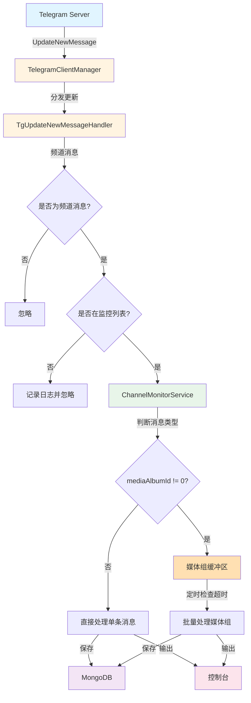

## 2. 应用启动流程

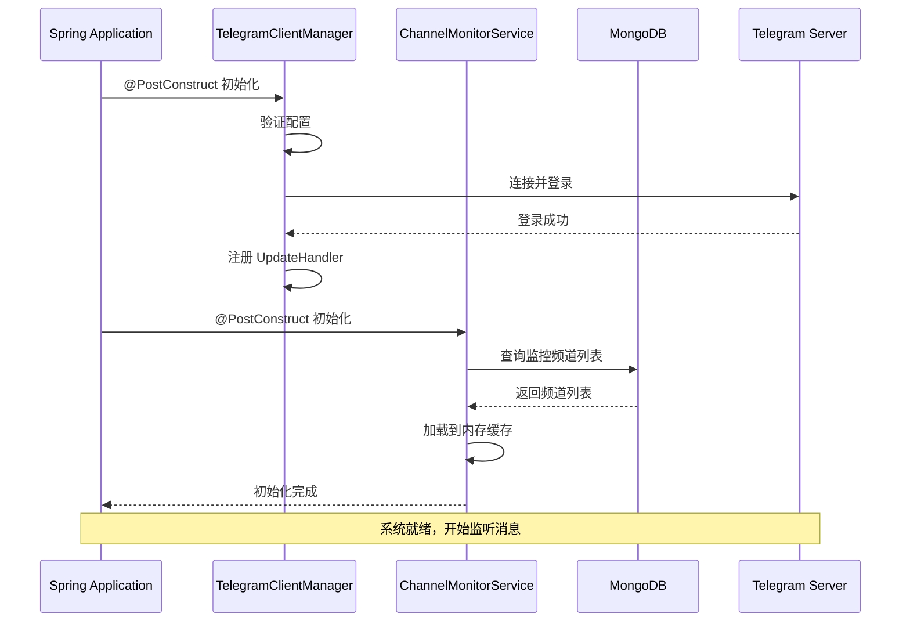

## 3. 消息接收和处理流程（含媒体组）

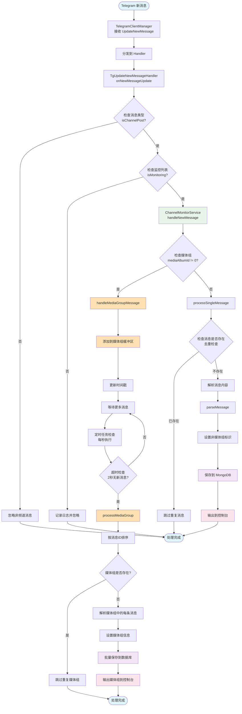

## 4. 消息内容解析详细流程

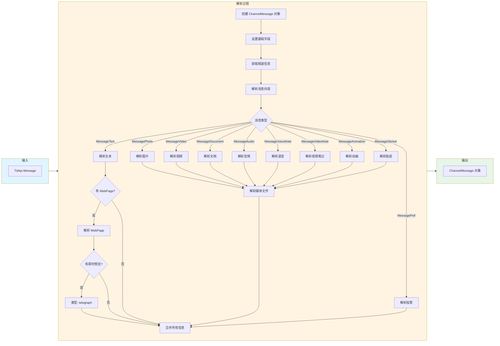

## 5. Telegraph 文章识别流程


## 6. 媒体组（消息组）处理详细流程

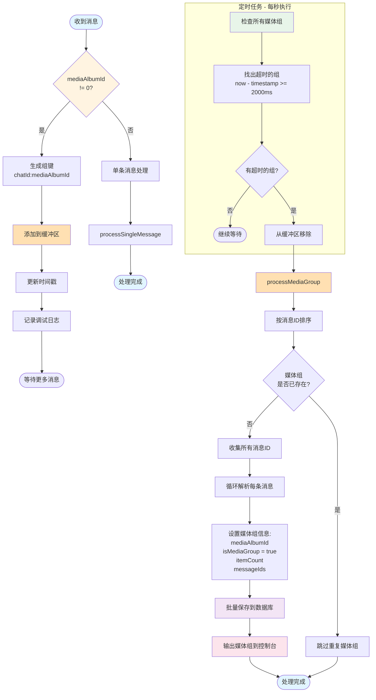

## 7. 数据库交互流程

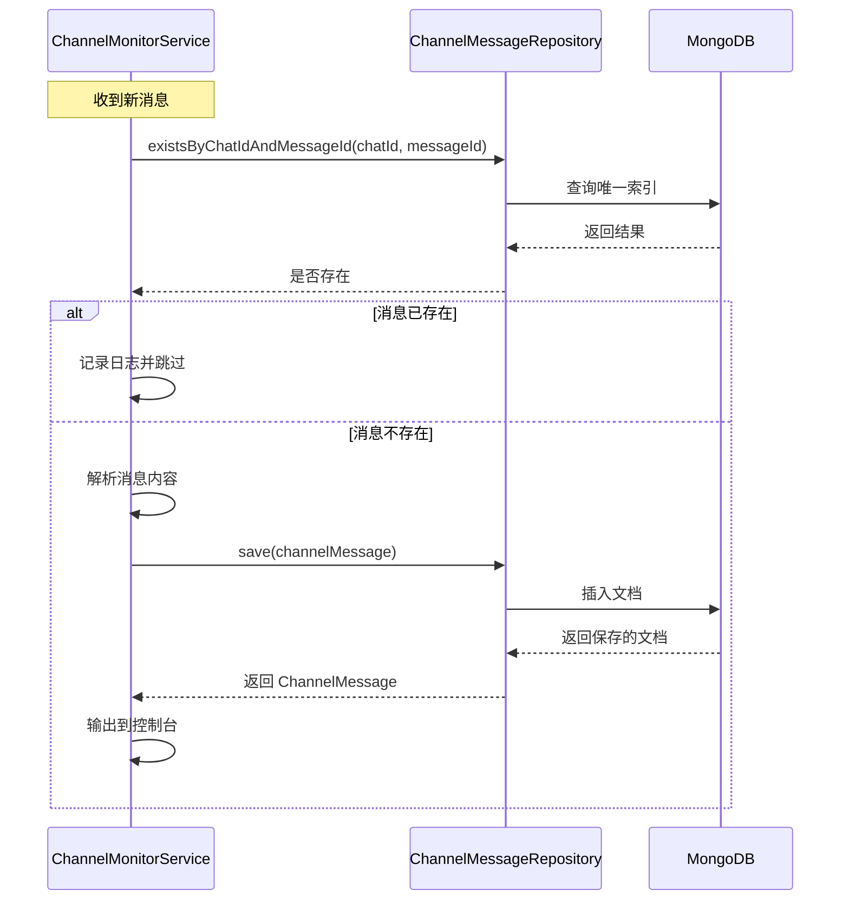

## 7. 数据库交互流程（含媒体组）

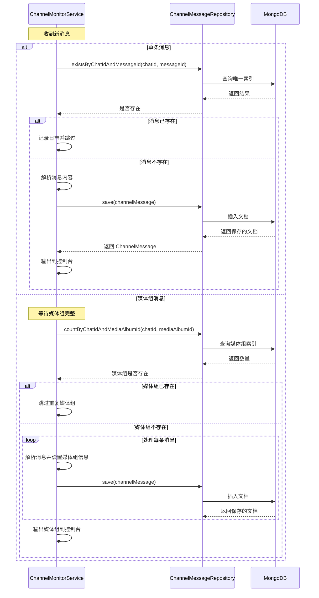

## 8. 监控频道管理流程

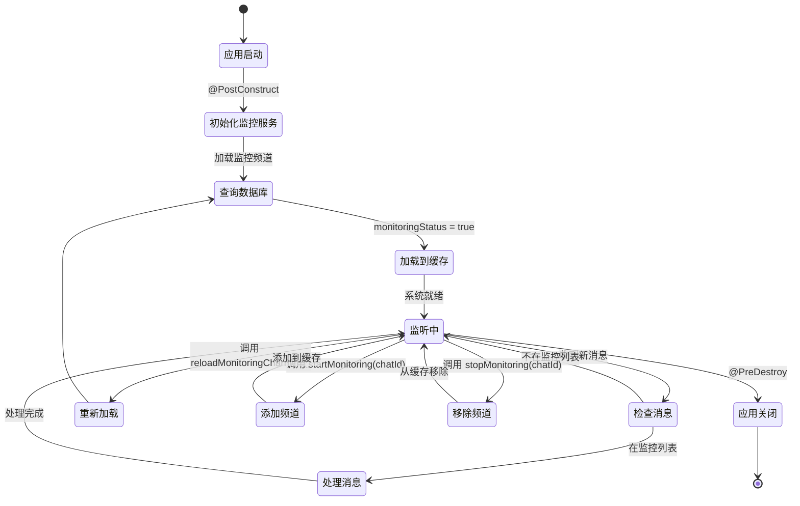

## 8. 监控频道管理流程

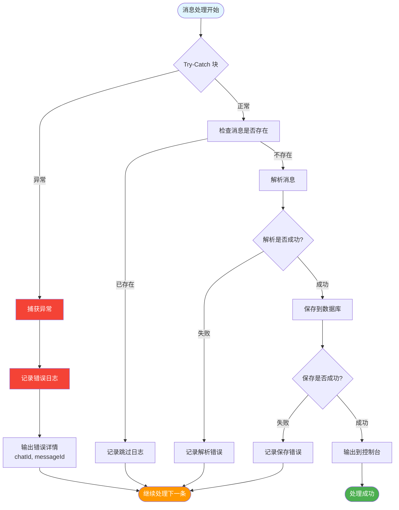

## 9. 错误处理流程

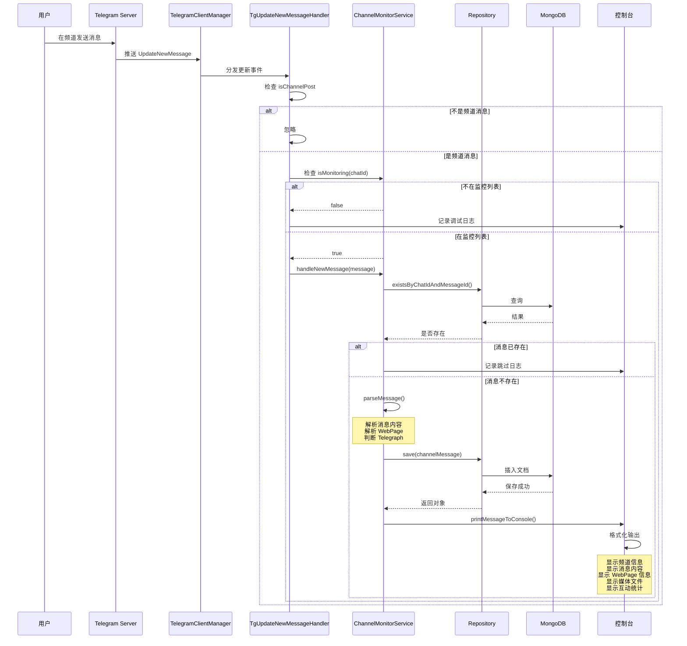

## 10. 完整的端到端流程（含媒体组）

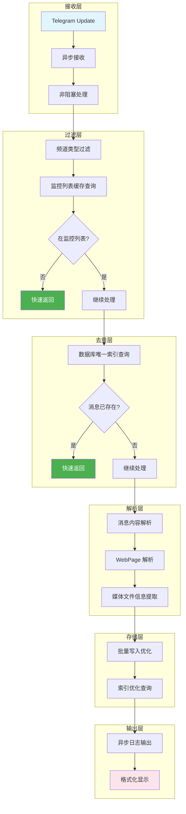

## 11. 性能优化流程

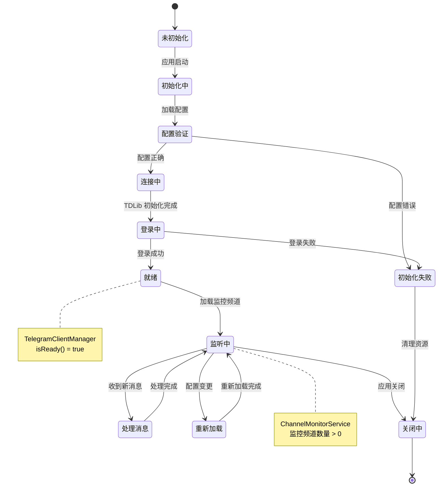

## 12. 系统状态机

### 图表类型说明

1. **graph TB/LR** - 基础流程图（从上到下/从左到右）
2. **flowchart TD/LR** - 增强流程图，支持更多形状
3. **sequenceDiagram** - 时序图，展示组件间交互
4. **stateDiagram-v2** - 状态机图，展示状态转换

### 节点形状说明

- `[]` - 矩形：普通处理步骤
- `{}` - 菱形：判断/决策点
- `()` - 圆角矩形：开始/结束
- `[()]` - 圆形：状态节点

### 颜色说明

- 蓝色 (#e1f5ff) - 输入/开始
- 黄色 (#fff4e1) - 处理中
- 绿色 (#e8f5e9) - 核心服务
- 紫色 (#f3e5f5) - 数据库
- 粉色 (#fce4ec) - 输出/显示

## 使用建议

1. **查看整体架构**：从图 1 开始，了解系统组件关系
2. **理解启动流程**：查看图 2，了解系统如何初始化
3. **跟踪消息处理**：查看图 3 和图 10，了解完整的消息处理流程
4. **理解媒体组处理**：查看图 5 和图 6，了解媒体组的缓冲和批量处理机制
5. **深入特定功能**：根据需要查看 Telegraph、错误处理等专项流程图
6. **性能优化参考**：查看图 11，了解系统的性能优化点

## 媒体组（消息组）处理说明

### 什么是媒体组？

媒体组（Media Album）是 Telegram 中将多个媒体文件（图片、视频、文档、音频）作为一组发送的功能。在 TDLib 中，属于同一媒体组的消息具有相同的非零 `mediaAlbumId`。

### 处理机制

1. **缓冲机制**：
   - 收到带有 `mediaAlbumId` 的消息时，不立即处理
   - 将消息添加到缓冲区，等待同组的其他消息
   - 使用 `chatId:mediaAlbumId` 作为缓冲区的键

2. **超时机制**：
   - 每秒检查一次缓冲区
   - 如果某个媒体组 2 秒内没有新消息，认为该组已完整
   - 触发批量处理

3. **批量处理**：
   - 按消息 ID 排序，确保顺序一致
   - 检查媒体组是否已存在（去重）
   - 为每条消息设置媒体组信息
   - 批量保存到数据库
   - 统一输出到控制台

### 数据结构

```java
// ChannelMessage 实体
private Long mediaAlbumId;              // 媒体组ID，0表示不属于任何组
private Boolean isMediaGroup;           // 是否为媒体组消息
private Integer mediaGroupItemCount;    // 媒体组中的项目数量
private List<Long> mediaGroupMessageIds; // 媒体组中所有消息的ID列表
```

### 控制台输出示例

```
━━━━━━━━━━━━━━━━━━━━━━━━━━━━━━━━━━━━━━━━━━━━━━━━━━━━━━━━━━━━━━━━━━━━━━━━━━━━━━
📨 收到媒体组消息
━━━━━━━━━━━━━━━━━━━━━━━━━━━━━━━━━━━━━━━━━━━━━━━━━━━━━━━━━━━━━━━━━━━━━━━━━━━━━━
频道: 测试频道 (@test_channel)
媒体组ID: 5629499534213120
频道ID: -1001234567890
消息数量: 3 条
时间: 2024-02-22T20:30:45
━━━━━━━━━━━━━━━━━━━━━━━━━━━━━━━━━━━━━━━━━━━━━━━━━━━━━━━━━━━━━━━━━━━━━━━━━━━━━━
📎 媒体组内容:
  [1] 消息ID: 123456, 类型: photo
      说明: 第一张图片
      - 文件类型: photo, 大小: 102400 bytes
  [2] 消息ID: 123457, 类型: photo
      说明: 第二张图片
      - 文件类型: photo, 大小: 204800 bytes
  [3] 消息ID: 123458, 类型: video
      说明: 一个视频
      - 文件类型: video, 大小: 1048576 bytes
━━━━━━━━━━━━━━━━━━━━━━━━━━━━━━━━━━━━━━━━━━━━━━━━━━━━━━━━━━━━━━━━━━━━━━━━━━━━━━
📊 互动: 浏览 0 次, 转发 0 次
━━━━━━━━━━━━━━━━━━━━━━━━━━━━━━━━━━━━━━━━━━━━━━━━━━━━━━━━━━━━━━━━━━━━━━━━━━━━━━
💾 数据库ID列表:
   - 65d7f8a9b1c2d3e4f5a6b7c8
   - 65d7f8a9b1c2d3e4f5a6b7c9
   - 65d7f8a9b1c2d3e4f5a6b7ca
━━━━━━━━━━━━━━━━━━━━━━━━━━━━━━━━━━━━━━━━━━━━━━━━━━━━━━━━━━━━━━━━━━━━━━━━━━━━━━
```

### 性能考虑

1. **内存占用**：
   - 缓冲区使用 ConcurrentHashMap，线程安全
   - 超时后自动清理，避免内存泄漏
   - 通常媒体组不超过 10 条消息

2. **处理延迟**：
   - 媒体组有 2 秒的等待时间
   - 确保收集完整后再处理
   - 避免拆分显示

3. **数据库优化**：
   - 使用复合索引 `{chatId, mediaAlbumId, date}`
   - 快速查询和去重
   - 支持按媒体组查询

### 查询示例

```javascript
// 查询特定媒体组的所有消息
db.channel_messages.find({
    chatId: -1001234567890,
    mediaAlbumId: 5629499534213120
}).sort({messageId: 1})

// 统计媒体组数量
db.channel_messages.aggregate([
    {$match: {isMediaGroup: true}},
    {$group: {
        _id: {chatId: "$chatId", mediaAlbumId: "$mediaAlbumId"},
        count: {$sum: 1}
    }}
])

// 查询包含视频的媒体组
db.channel_messages.find({
    isMediaGroup: true,
    contentType: "video"
})
```

## 相关文档

- [Telegram频道实时监控技术方案](./Telegram频道实时监控技术方案.md)
- [Telegraph支持说明](./Telegraph支持说明.md)
- [功能实现总结](./功能实现总结.md)
- [Telegraph-Testing-Guide](./Telegraph-Testing-Guide.md)
